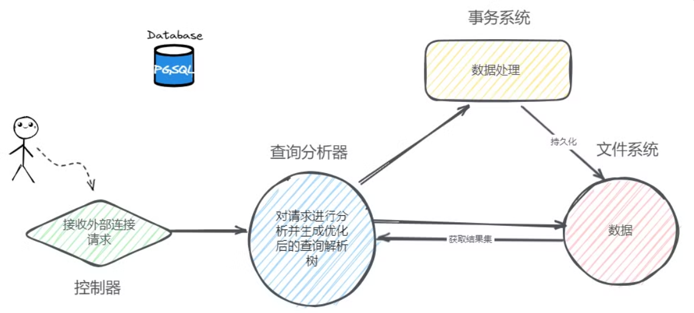

# 体系结构

pgsql的体系结构分为以下5大部分：

**系统控制器、查询分析器、事务系统、恢复系统、文件系统**




## 存储结构 

###  逻辑存储结构 


**跨数据库集群访问**

```sql
-- 在postgres集群访问pgostgres2集群的test2表
insert into pgostgres2."public".test2 (id) VALUES (1)

-- *错误:  未实现跨数据库关联: "pgostgres2.public.test2"* 
-- *LINE 1: insert into pgostgres2."public".test2 (id) VALUES (1)* 
```

**同一数据库集群下不同数据库相互访问**


###  物理存储结构 

数据文件默认存储路径：postgres/14/data/base/


 **OID：（数据库）对象标识符** 

 **表空间：** 


## 进程结构


| 辅助进程                 | 作用                                                         |
| ------------------------ | ------------------------------------------------------------ |
| **background writer**    | 也可以称为bgwriter进程，bgwriter进程很多时候都是在休眠状态，每次唤醒后它会搜索共享缓冲池(shared buff pool)找到被修改的⻚，并将它们从共享缓冲池刷出 |
| **autovacuum launcher**  | ⾃动清理回收垃圾进程                                         |
| **statistics collector** | 统计信息收集进程                                             |
| **logging collector**    | ⽇志进程，将消息或错误信息写⼊⽇志                           |
| **WAL writer**           | 定期将WAL缓冲区(WAL buffer)上的WAL数据写⼊磁盘               |
| **archiver**             | WAL归档进程                                                  |
| **checkpointer**         | 检查点进程                                                   |


##  内存结构 


