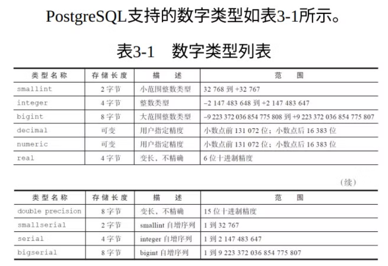
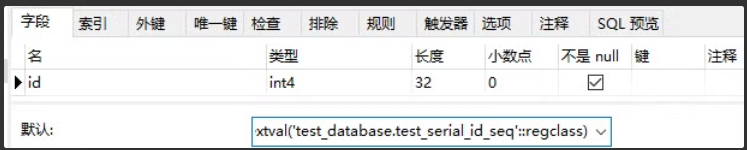

 # 数据类型精度 




##  smallserial、serial和bigserial 

 这些指⾃增serial类型，严格意义上不能称之为⼀种数据类型 

```sql
-- 创建一个测试表
CREATE TABLE test_serial (id serial,flag text);
-- 此时会自动给test_serial的id字段创建一个自增序列，并将id的默认值设置为nextval('xxx_seq')

-- 所以插⼊表数据时可以不指定serial字段名称，将⾃动使⽤序列值填充
INSERT INTO test_serial(flag) VALUES ('a');
```

 如下图可以看到id字段的默认值会取test_serial_id_seq’序列的最新值 




## JSON与JSONB

json类型以⽂本存储并且存储的内容和输⼊数据⼀样，当检索json数据时必须重新解析

jsonb以⼆进制形式存储已解析好的数据，当检索jsonb数据时不需要重新解析

> **因此json写⼊⽐jsonb快，但检索⽐jsonb慢**

jsonb会删除重复的键，仅保留最后⼀个

**在⼤多数应⽤场景下建议使⽤jsonb，除⾮有特殊的需求，⽐如对json的键顺序有特殊的要求**