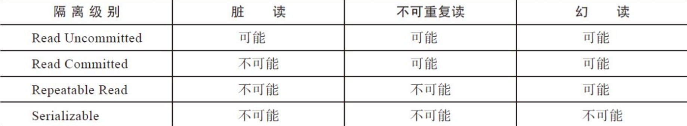
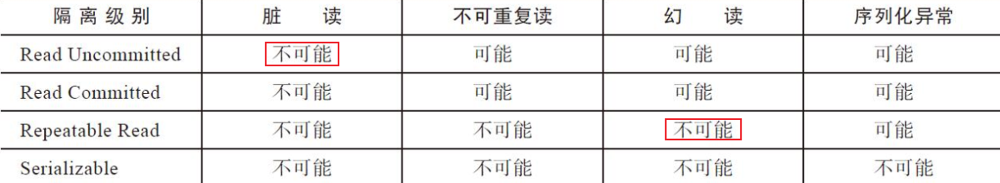
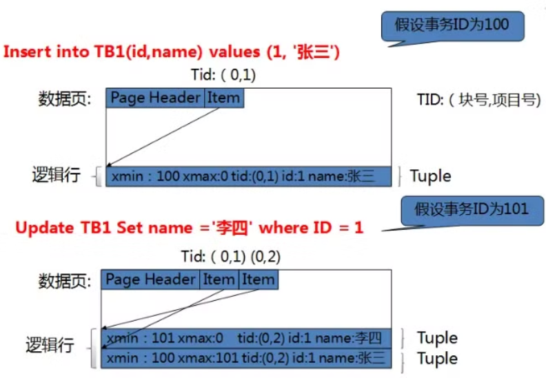

# MVCC

##  事务与并发控制 

###  概念 

事务是数据库系统执行过程中**最小**的逻辑单位

在PostgreSQL中，显式地指定`BEGIN...END/COMMIT/ROLLBACK`**包括的语句块或⼀组语句**为⼀个事务，

未指定`BEGIN...END/COMMIT/ROLLBACK`的**单条语句**也称为⼀个事务。

###  事务四个重要的特性 

> **原子性**（**A**tomicity）：一个事务的所有操作，要么全部执行，要么全部不执行 （由事务管理器和MVCC控制）

> **一致性**（**C**onsistency）：执行事务时保持数据库从一个一致的状态变更到另一个一致的状态  （由主键、外键这类约束保证）

> **隔离性**（**I**solation）：即使每个事务都能确保一致性和原子性，如果并发执行时，由于它们的操作以人们不希望的方式交叉运行，就会导致不一致的情况发生。确保事务与事务并发执行时，每个事务都感觉不到有其他事务在并发执行  （由事务管理器和MVCC控制）

> **持久性**（**D**urability）：一个事务完成之后，即使数据库发生故障，它对数据库的改变应该永久保存在数据库中  （由WAL和恢复系统保证）

### 并发引起的现象 

> **脏读**（Dirty read）：当第⼀个事务读取了第⼆个事务中已经修改但还未提交的数据

> **不可重复读**（Non-repeatable read）：当⼀个事务第⼀次读取数据之后，被读取的数据被另⼀个已提交的事务进⾏了修改，事务再次读取这些数据时发现数据已经被另⼀个事务修改，两次查询的结果不⼀致

> **幻读**（Phantom Read）：⼀个事务的两次查询的结果集记录数不⼀致

###  四类事务隔离级别 

> **读未提交**（Read Uncommitted）：在该隔离级别，所有事务都可以看到其他未提交事务的执行结果（在并发情况下，查询结果⾮常不可控 性能也并不⽐其他事务隔离级别好多少）

> **读已提交**（Read Committed）：这是PostgreSQL的默认隔离级别，它满⾜了⼀个事务只能看见已经提交事务对关联数据所做的改变的隔离需求

> **可重复读**（Repeatable Read）：确保同⼀事务的多个实例在并发读取数据时，会看到同样的数据行

> **可序列化**（Serializable）：这是最高的隔离级别，它通过强制事务排序，使之不可能相互冲突，从而解决幻读问题。简言之，它是在每个读的数据行上加上共享锁。在这个级别，可能导致大量的超时现象和锁竞争。

隔离级别越高，需要系统资源越多，对并发性影响越大，吞吐量也会更低，优先考虑Read Committed隔离级别，能够避免脏读且具有较好的并发性能。尽管它会导致不可重复读、幻读、丢失更新这些并发问题，在可能出现这类问题的个别场合，可以由程序采用悲观锁和乐观锁来控制。 

**数据库标准中不同的事务隔离级别与读现象的关系** 

**PostgreSQL中不同的事务隔离级别与读现象的关系** 

1. PostgreSQL内部将Read Uncommitted设计为和Read Committed一样，所以PostgreSQL中不会产生脏读。
2. PostgreSQL的Repeatable Read实现不允许幻读。

## MVCC

> **Multi-Version Concurrency Control，即多版本并发控制**

pgsql中每行数据都有隐藏列`xmin`和`xmax`

数据创建时，`xmin`会被设置为当前事务`id`；

数据更新时，原数据行的`xmax`会被设置为当时事务id，且会新插入一条数据，`xmin`设置为当前事务id（如下图所示），表示为2个不同版本；

数据删除时，`xmax`会被设置为当前事务`id`。

在读已提交的隔离级别下，只要其他事务已提交，就能够查询到其他事务的提交结果

而在可重复读的隔离级别，更新和删除数据时，当前事务是无法查询到其他事务的提交结果；而插入数据，则会比较xmin的事务id（xid>xmin）

读已提交看到的是**当前查询开始时的快照**

可重复度看到的是**当前事务开始时的快照**

> xmax不为0时，意味着从表中逻辑删除（delete or update会产生），需要等待autovacuum进程或者手动执行VACUUM，释放空间