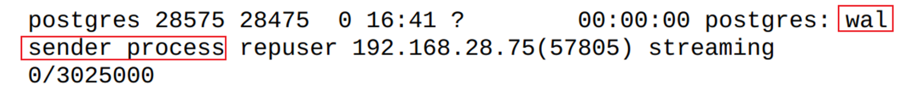
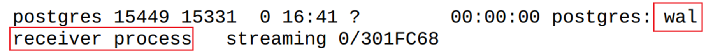

# 主备复制

## 物理复制

物理复制也称为流复制

通过流复制技术，可以从**实例级**复制出⼀个与主库⼀模⼀样的从库（也称之为备库）

主库将预写⽇志WAL⽇志流发送给备库，备库接收到WAL⽇志流后进⾏重做

流复制主库可读写 ，但从库只允许查询不允许写⼊

流复制能对DDL操作进⾏复制 （比如新建表、给已有表增减字段）

| 同步流复制                                                   | 异步流复制                                                  |
| ------------------------------------------------------------ | ----------------------------------------------------------- |
| 主库上提交事务时需等待备库接收并WAL⽇志，当主库至少收到一个备库发回的确认信息时便返回成功 | 主库上提交事务时不需要等待备库接收并写⼊WAL⽇志时便返回成功 |
| 数据完整性高                                                 | 数据完整性低（出现故障时备库会丢失数据）                    |
| 吞吐量低                                                     | 吞吐量高                                                    |


以数据文件拷贝的方式部署流复制 

```sql
-- pg_start_backup（）函数在主库上发起⼀个在线备份，命令执⾏成功后，将数据⽂件拷贝到备节点
SELECT pg_start_backup('francs_bk1');

-- tar 压缩文件、scp传输到备节点

-- ⽂件拷⻉到备节点后，在主库上执⾏以下命令，表示完成备份
SELECT pg_stop_backup();
```

 配置好备节点配置后，启动备节点数据库，可查看主备库上的WAL发生/接收进程。**此时主库的修改会自动同步到备库**。 






**流复制监控**

`pg_stat_replication`视图显⽰WAL发送进程的详细，视图关键字段

**`state`** ：显⽰WAL发送进程的状态

| state     | description                                             |
| --------- | ------------------------------------------------------- |
| startup   | WAL进程在启动过程中                                     |
| catchup   | 备库正在追赶主库                                        |
| streaming | 备库已追上主库，WAL日志流正常发送中（流复制的正常状态） |
| backup    | 通过pg_basebackup进行备份                               |
| stopping  | WAL发送进程正在关闭                                     |

**通过lag字段可监控主备延迟**

事实上当流复制主库、备库机器负载较低的情况下主备延迟通常能在毫秒级，数据库越繁忙或数据库主机负载越⾼主备延迟越⼤

- **`write_lag`**: 主库上WAL⽇志落盘后等待备库接收WAL⽇志（这时WAL⽇志流还没写⼊备库WAL⽇志⽂件，还在操作系统缓存中）并返回确认信息的时间。
- **`flush_lag`**: 主库上WAL⽇志落盘后等待备库接收WAL⽇志（这时WAL⽇志流已写⼊备库WAL⽇志⽂件，但还没有应⽤WAL⽇志）并返回确认信息的时间。
- **`replay_lag`**: 主库上WAL⽇志落盘后等待备库接收WAL⽇志（这时WAL⽇志流已写⼊备库WAL⽇志⽂件，并且已应⽤WAL⽇志）并返回确认信息的时间。


## 逻辑复制

逻辑复制可以**选择性地复制特定的表或数据库**，而不是整个数据库实例。这使得逻辑复制在数据迁移、分布式数据库系统和高可用性架构中非常有用。 

### 逻辑复制的基本概念

- **逻辑复制**：基于数据库逻辑层面的数据更改进行复制，支持对特定表的选择性复制。逻辑复制使用发布（Publication）和订阅（Subscription）机制。
- **发布（Publication）**：数据源（发布端）上指定要复制的表。发布可以包括一个或多个表。
- **订阅（Subscription）**：在目标数据库（订阅端）上，定义要从发布端复制数据的订阅，订阅会指定要接收哪些发布的数据。


###  配置逻辑复制 

在 PostgreSQL 的配置文件 `postgresql.conf` 中，确保以下设置启用：

```properties
# 必须设置为 logical 以支持逻辑复制。
wal_level = logical
# 指定最大复制槽数量。
max_replication_slots = 4
# 指定最多允许的 WAL 发送器数量。
max_wal_senders = 4
```

 **配置发布**： 在源数据库中，使用 `CREATE PUBLICATION` 命令创建一个发布，指定要复制的表。 

```sql
CREATE PUBLICATION my_pub FOR TABLE my_table;
```

 **配置订阅**： 在目标数据库中，使用 `CREATE SUBSCRIPTION` 命令创建一个订阅，连接到源数据库并指定要接收的发布。 

```sql
CREATE SUBSCRIPTION my_sub CONNECTION 'host=source_db_host dbname=source_db user=my_user password=my_password' PUBLICATION my_pub;
```

当源数据库中的指定表发生插入、更新或删除操作时，这些更改会记录在逻辑复制流中，并通过 WAL（Write Ahead Log） 发送到目标数据库。  目标数据库的订阅会接收这些更改，并将它们应用到相应的表中。 

**查看复制状态：**

```sql
SELECT * FROM pg_stat_subscription;  -- 查看订阅状态
```


### 逻辑复制的优点

- **选择性复制**：可以选择特定的表进行复制，而不必复制整个数据库。
- **更灵活的数据同步**：支持异构环境中数据的同步。
- **便于数据迁移**：可以方便地将数据从一个数据库迁移到另一个数据库。
- **高可用性和负载均衡**：可以使用逻辑复制实现高可用性和负载均衡的解决方案。

### 逻辑复制的局限性

- **性能开销**：逻辑复制可能会引入一定的性能开销，尤其是在大量数据更新时。
- **数据一致性**：逻辑复制依赖于事务顺序，因此需要小心处理数据一致性问题。
- **版本兼容性**：逻辑复制通常要求发布端和订阅端运行相同的 PostgreSQL 版本，或者至少在同一主要版本系列中。


### 逻辑复制槽

是一种 **PostgreSQL 机制**，用于管理流式复制（包括逻辑复制）的数据流。它可以保证复制数据的可用性，防止在目标数据库未能及时接收数据时，源数据库清除未发送的 WAL（Write Ahead Log）日志。 

#### 工作原理

**1. 创建复制槽**： 在创建逻辑复制订阅时，PostgreSQL 会自动为每个订阅创建一个逻辑复制槽。这个槽用来记录所有需要发送到订阅的更改。

```sql
SELECT * FROM pg_create_logical_replication_slot('my_slot', 'pgoutput');
```

这里，`pgoutput` 是逻辑复制输出插件，负责将 WAL 日志转化为逻辑数据更改。

**2. WAL 日志管理**： 当源数据库中的数据发生变化时，这些变化会被记录在 WAL 中。逻辑复制槽会保持对这些 WAL 日志的引用，直到目标数据库确认接收这些数据。**这样，即使目标数据库因某种原因未能及时接收数据，源数据库也不会删除相关的 WAL 日志。**

*极端情况下会导致WAL日志一直不删除而打满磁盘*

**3. 数据确认**： 目标数据库在处理完从源数据库接收到的数据后，会向源数据库发送确认。这种确认机制确保了数据的一致性，避免了数据丢失。

**4. 删除复制槽**： 一旦目标数据库确认接收了所有数据并且不再需要该槽，可以手动删除逻辑复制槽。

```sql
SELECT pg_drop_logical_replication_slot('my_slot');
```

#### 优点

- **数据安全**：逻辑复制槽可以确保在网络延迟或其他故障情况下，不会丢失数据。
- **流式复制**：支持实时数据流式复制，适合高可用性和负载均衡的场景。

